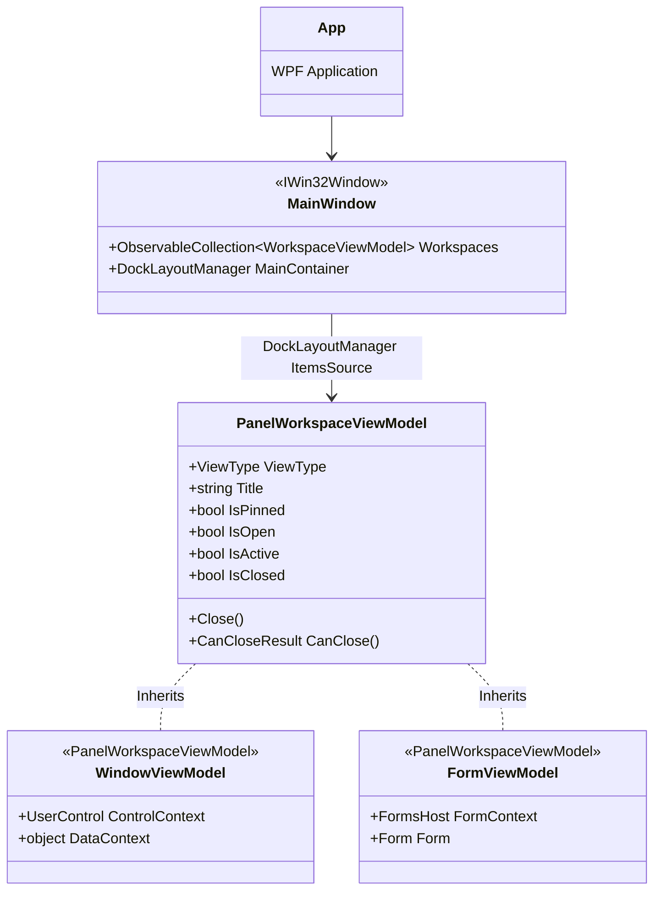

# WindowsCrashDemo

## Background

This project is an extremely stripped down version of a WPF applicaiton that still had some WinForms components not yet converted to WPF but still needed to still be supported. The application used the [DevExpress Dock Layout](https://docs.devexpress.com/WPF/6191/controls-and-libraries/layout-management/dock-windows) to manage the panels which contained either a [UserControl](https://learn.microsoft.com/en-us/dotnet/api/system.windows.controls.usercontrol?view=windowsdesktop-7.0) or [Form](https://learn.microsoft.com/en-us/dotnet/api/system.windows.forms.form?view=windowsdesktop-7.0). Following the MVVM architectural pattern, there was a View and ViewModel for each type of hosted content. That View and ViewModel functioned as a wrapper for the child control so that it could be docked, undocked, resized, maximized, etc. The [Form](https://learn.microsoft.com/en-us/dotnet/api/system.windows.forms.form?view=windowsdesktop-7.0) would also use the [Text](https://learn.microsoft.com/en-us/dotnet/api/system.windows.forms.form.text?view=windowsdesktop-7.0) for the panel's header as well as the [Icon](https://learn.microsoft.com/en-us/dotnet/api/system.windows.forms.form.icon?view=windowsdesktop-7.0) and dispose of unmanaged resources with [IDisposable](https://learn.microsoft.com/en-us/dotnet/api/system.idisposable?view=net-7.0), and more.

The Windwos Forms interopability was done using the [FormsHost](https://github.com/syntax-tm/WindowsHangBug/blob/master/WindowsCrashDemo/Views/FormsHost.xaml) [Control](https://learn.microsoft.com/en-us/dotnet/api/system.windows.controls.control?view=windowsdesktop-7.0). [FormsHost](https://github.com/syntax-tm/WindowsHangBug/blob/master/WindowsCrashDemo/Views/FormsHost.xaml) is a custom UserControl that contains a [WindowsFormsHost](https://learn.microsoft.com/en-us/dotnet/api/system.windows.forms.integration.windowsformshost?view=windowsdesktop-7.0) element to host WinForms Controls.

On startup, the application creates the [MainWindow](https://github.com/syntax-tm/WindowsHangBug/blob/master/WindowsCrashDemo/MainWindow.xaml). [MainWindow](https://github.com/syntax-tm/WindowsHangBug/blob/master/WindowsCrashDemo/MainWindow.xaml) is a [Window](https://learn.microsoft.com/en-us/dotnet/api/system.windows.window?view=windowsdesktop-7.0) containing the [DockLayoutManager](https://docs.devexpress.com/WPF/DevExpress.Xpf.Docking.DockLayoutManager) and its ViewModel, [MainWindowViewModel](https://github.com/syntax-tm/WindowsHangBug/blob/master/WindowsCrashDemo/ViewModels/MainWindowViewModel.cs), contains the collection of document panels and groups bound using the DockLayoutManager's [ItemsSource](https://docs.devexpress.com/WPF/DevExpress.Xpf.Docking.DockLayoutManager.ItemsSource).

## Architecture



## The Bug

[MainWindow](https://github.com/syntax-tm/WindowsHangBug/blob/master/WindowsCrashDemo/MainWindow.xaml) implements the [IWin32Window](https://learn.microsoft.com/en-us/dotnet/api/system.windows.forms.iwin32window?view=windowsdesktop-7.0) interface to expose the HWND [Handle](https://learn.microsoft.com/en-us/dotnet/api/system.windows.forms.iwin32window.handle?view=windowsdesktop-7.0). The [Handle](https://learn.microsoft.com/en-us/dotnet/api/system.windows.forms.iwin32window.handle?view=windowsdesktop-7.0) is needed for Windows API calls, the [HwndSource](https://learn.microsoft.com/en-us/dotnet/api/system.windows.interop.hwndsource?view=windowsdesktop-7.0) class has an [AddHook](https://learn.microsoft.com/en-us/dotnet/api/system.windows.interop.hwndsource.addhook?view=windowsdesktop-7.0) method used to receive window messages, and various other things. Only the [IWin32Window](https://learn.microsoft.com/en-us/dotnet/api/system.windows.forms.iwin32window?view=windowsdesktop-7.0) implementation was necessary for this demo.

This issue is with the [WindowInteropHelper](https://learn.microsoft.com/en-us/dotnet/api/system.windows.interop.windowinterophelper?view=windowsdesktop-7.0) and its [Owner](https://learn.microsoft.com/en-us/dotnet/api/system.windows.interop.windowinterophelper.owner?view=windowsdesktop-7.0) property. Instead of setting the [Owner]() to the HWND of the Application's [MainWindow](https://github.com/syntax-tm/WindowsHangBug/blob/master/WindowsCrashDemo/MainWindow.xaml) [Handle](https://learn.microsoft.com/en-us/dotnet/api/system.windows.forms.iwin32window.handle?view=windowsdesktop-7.0), this code sets it to the newly created Form's Handle. Basically, the Owner is set to the child.

### WindowInteropHelper

> _An example scenario is if you need to host a WPF dialog box in a Win32 application. Initialize the WindowInteropHelper with a WPF window object for the dialog box. You can then get the WPF window's handle (HWND) from the Handle property and specify the owner for the WPF window with the Owner property. The following code example shows how to use WindowInteropHelper when hosting a WPF dialog box in a Win32 application._
>
> ```cs
> WindowInteropHelper wih = new WindowInteropHelper(myDialog);
> wih.Owner = ownerHwnd;
> myDialog.ShowDialog();
> ```
>
> _**Another scenario supported by this class is to obtain a HwndSource object from a WPF Window object. The HwndSource enables direct processing of Win32 messages through the AddHook method.** By using HwndSource and AddHook in place of a Window you can still handle messages that have no equivalent or handling in WPF. Create a WindowInteropHelper with the Window source, then call Handle on the WindowInteropHelper to get from HWND to HwndSource._ ([Source](https://learn.microsoft.com/en-us/dotnet/api/system.windows.interop.windowinterophelper?view=windowsdesktop-7.0#remarks))

### Demo

```cs
public void OpenFormWorkspace(Type formType, ViewType viewType, bool setInvalidOwner = false)
{
    try
    {
        var closeCommand = new DelegateCommand(() => CloseWorkspace(viewType));
        var workspace = new FormViewModel(viewType, formType, closeCommand);

        if (setInvalidOwner)
        {
            // ...

            var winForm = workspace.WinForm;

            //  this should NOT be allowed to happen, the WinForms control is inside of a FormsIntegrationHost
            //  which is inside of the WPF Window. The Window is the parent, but the Window's Owner can be set to
            //  a child WinForms control's Handle which crashes Windows
            var windowInteropHelper = new WindowInteropHelper(MainWindow);
            windowInteropHelper.Owner = winForm.Handle;
        }

        Workspaces.Add(workspace);

        SelectedWorkspace = workspace;
    }
    catch (Exception ex)
    {
        // ...
    }
}
```

The relevant part here is the new [WindowInteropHelper](https://learn.microsoft.com/en-us/dotnet/api/system.windows.interop.windowinterophelper?view=windowsdesktop-7.0) created using the application's MainWindow and then the [Owner](https://learn.microsoft.com/en-us/dotnet/api/system.windows.interop.windowinterophelper.owner?view=windowsdesktop-7.0) set to the `winForm.Handle`. 

```cs
var windowInteropHelper = new WindowInteropHelper(MainWindow);
windowInteropHelper.Owner = winForm.Handle;
```

Adding and selecting the newly created `workspace` (`FormViewModel`) does not crash Windows. The crash comes from when we create a modal (dialog) inside that `winForm`.

The [MainWindowViewModel](https://github.com/syntax-tm/WindowsHangBug/blob/master/WindowsCrashDemo/ViewModels/MainWindowViewModel.cs) has two `ICommand` properties for creating either a normal `frmChildForm` or an invalid `frmChildForm` which uses the `WindowInteropHelper` above.

```
public MainWindowViewModel()
{
    // ...
    OpenFormCommand = new DelegateCommand(() => OpenChildForm());
    OpenFormErrorCommand = new DelegateCommand(() => OpenChildForm(true));
    // ...
}

private void OpenChildForm(bool setParent = false)
{
    var type = typeof(frmChildForm);
    OpenFormWorkspace(type, ViewType.ChildForm, setParent);
}
```

Selecting the `Error Form` menu item will execute the `ICommand` set in the binding (`OpenFormErrorCommand`). After the new `frmChildForm` is created you can use either the `ShowDialog Form` or `Show Form` button. Both of these will create a new `frmDialogTest` but `ShowDialog Form` will call `ShowDialog` and `Show Form` will instead call `Show`. Both methods will pass the `Parent` property of the [Form](https://learn.microsoft.com/en-us/dotnet/api/system.windows.forms.form?view=windowsdesktop-7.0) (inherited from [Control](https://learn.microsoft.com/en-us/dotnet/api/system.windows.forms.control?view=windowsdesktop-7.0)).

```vb
Private Sub btnOpenForm_Click(sender As Object, e As EventArgs) Handles btnOpenForm.Click
    Dim frm As New frmDialogTest
    frm.Show(Parent)
End Sub

Private Sub btnOpenModal_Click(sender As Object, e As EventArgs) Handles btnOpenModal.Click
    Dim frm As New frmDialogTest
    frm.ShowDialog(Parent)
End Sub
```

## References

- [WPF and Windows Forms Interoperation](https://learn.microsoft.com/en-us/dotnet/desktop/wpf/advanced/wpf-and-windows-forms-interoperation?view=netframeworkdesktop-4.8)
- [IWin32Window](https://learn.microsoft.com/en-us/dotnet/api/system.windows.forms.iwin32window?view=windowsdesktop-7.0)
- [System.Windows.Controls](https://learn.microsoft.com/en-us/dotnet/api/system.windows.controls?view=windowsdesktop-7.0)